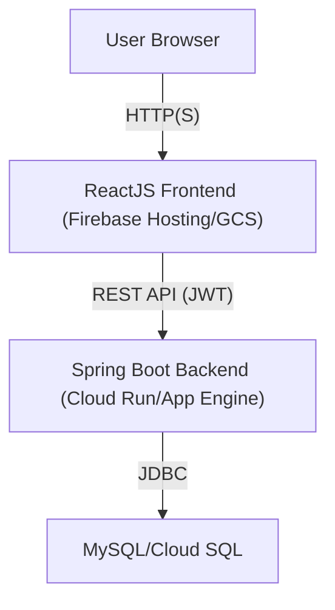
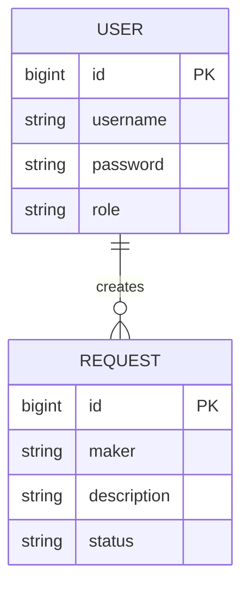
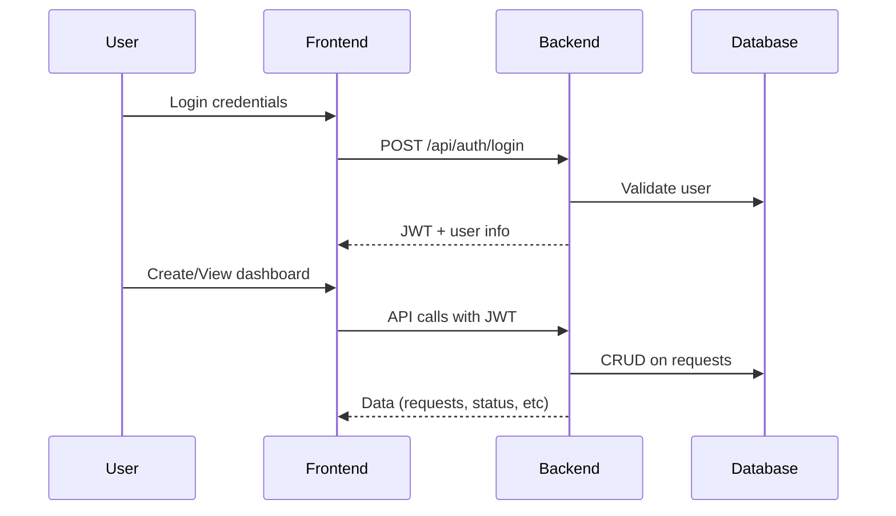

# Maker-Checker Dashboard Documentation

## Overview

The Maker-Checker Dashboard is a web application for request approval workflows. It uses a ReactJS frontend, a Spring Boot backend, JWT authentication, and a MySQL/Cloud SQL database.

---

## Architecture Diagram

---

## Entity Relationship Diagram (ERD)

---

## Components

### Frontend (ReactJS)
- **Login page**: Authenticates users, stores JWT
- **Maker dashboard**: Submit/view requests
- **Checker dashboard**: Approve/Reject requests

### Backend (Spring Boot)
- **AuthController**: Login endpoint, JWT issuing
- **MakerCheckerController**: Request CRUD endpoints (role-based)
- **JwtUtil/SecurityConfig**: JWT validation and access control

### Database (MySQL/Cloud SQL)
- **user** table: Stores users (maker/checker)
- **request** table: Stores requests and their status

---

## Deployment

- **Frontend**: Firebase Hosting / GCS Bucket
- **Backend**: Cloud Run / App Engine (Docker or JAR)
- **Database**: Cloud SQL (MySQL 8.0+, provisioned via Terraform or GCP Console)

---

## Data Flow

1. **Login**: User logs in, JWT issued and saved in browser.
2. **Request Operations**: Frontend sends API requests with JWT. Backend verifies JWT and role; interacts with database.
3. **Maker**: Can create/view own requests.
4. **Checker**: Can view all pending requests, approve/reject.

---

## Example API Endpoints

- `POST /api/auth/login` – Login, returns JWT
- `GET /api/requests` – List all requests (role-based)
- `POST /api/requests` – Create new request (Maker only)
- `PUT /api/requests/{id}` – Approve/Reject request (Checker only)

---

## Example Database Schema

### user
| Field    | Type    | Description        |
|----------|---------|-------------------|
| id       | bigint  | Primary key       |
| username | varchar | Unique            |
| password | varchar | Hashed (in prod)  |
| role     | varchar | "Maker"/"Checker" |

### request
| Field       | Type    | Description       |
|-------------|---------|------------------|
| id          | bigint  | Primary key      |
| maker       | varchar | Username of Maker|
| description | varchar | Request details  |
| status      | varchar | Pending/Approved/Rejected |

---

## Security Notes

- All endpoints except `/api/auth/login` require JWT.
- Roles enforced in backend controllers.
- Passwords should be stored hashed (BCrypt) in production.

---

## Extensibility

- Add user registration
- Add request types or workflow steps
- Add audit log/table
- Add notifications (email/webhook)

---

## Sequence Example

---

## Contributing

1. Clone repo
2. Setup MySQL/Cloud SQL and seed users
3. Run backend (`mvn spring-boot:run`)
4. Run frontend (`npm start`)
5. For deployment, see [GCP documentation](https://cloud.google.com/).

---
